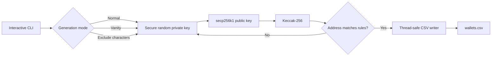

# EVM Wallet Forge


**A fast, local EVM wallet generator with normal, vanity, and exclusion modes.**
It uses operating-system randomness, OpenSSL secp256k1, Ethereum Keccak-256,
and a reusable Zig thread pool.

## Quick Start

```sh
git clone <your-repository-url>
cd gen
chmod +x install.sh run.sh
./install.sh
./run.sh
```

The installer handles compiler, build, and OpenSSL prerequisites. It installs
Zig in `~/.local/zig` and does not require a system-wide Zig package.

## How It Works



## Modes

Each run opens an interactive menu and asks for the wallet count:

1. Generate normal wallets.
2. Generate vanity wallets by matching up to 10 hexadecimal characters after
	`0x` or at the end of the address.
3. Generate wallets excluding a comma-separated list of hexadecimal characters,
	such as `b,6,f`.

The output is written to `wallets.csv` (address has no `0x`; private key keeps
its `0x` prefix):

```text
address,private_key
0123abcd...,0x...
```

## Performance

The default pool size is **100 workers per detected CPU core**, capped by the
requested wallet count. Override it with `--worker`:

```sh
./run.sh --count 100000 --worker 1000
```

Green progress shows completed wallets; red shows remaining work. Vanity and
exclusion difficulty is probabilistic, so a longer pattern can require many
more attempts regardless of worker count.

## Manual Build

The build links OpenSSL's secp256k1 implementation and includes the Ethereum
Keccak-256 implementation in `deps/keccak`.

```sh
zig build -Doptimize=ReleaseFast
zig build run -Doptimize=ReleaseFast -- --count 1000 --worker 400
```

## Security

- Private keys come from `std.crypto.random`, backed by the operating system.
- `wallets.csv` contains spendable secrets. Treat it like a password vault.
- Never commit, upload, or paste generated private keys into chat or issue trackers.
- This tool does not connect to a blockchain or check balances.
